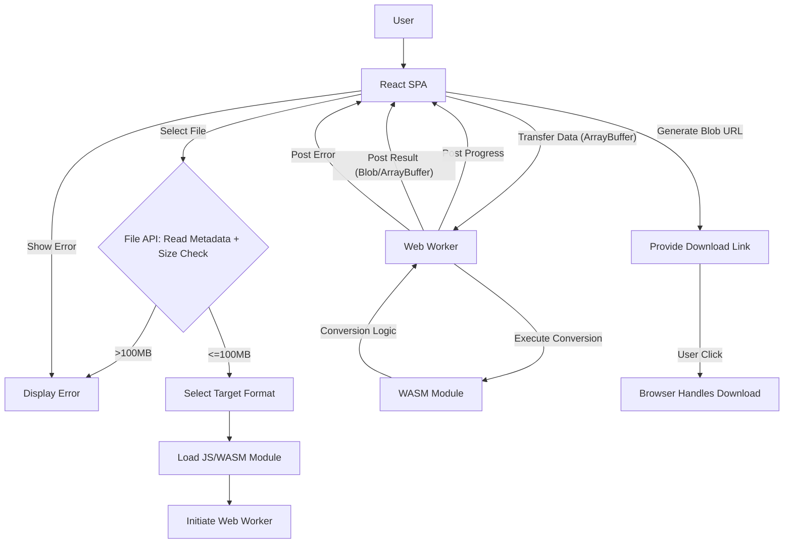

# Architecture: Local File Converter v1.0

## Core Principles

- **Client-Side Single Page Application (SPA):** All UI, file handling, and conversion logic executes in the user's browser.
- **No Conversion Backend:** The web server only serves static assets (HTML, CSS, JS, WASM). It MUST NOT handle file uploads for conversion.
- **Modular Conversion Engines:** Each conversion type (or related group) is encapsulated in a distinct module (JS + WASM).
- **Lazy Loading:** Modules SHOULD be loaded on demand to minimize initial load time.
- **Web Workers:** Intensive conversion tasks MUST run in Web Workers to keep the UI responsive.

## High-Level Flow

## Components

1.  **React SPA (Main Thread):**
    *   Handles UI rendering and user interactions.
    *   Manages file selection and initial validation (size, extension).
    *   Orchestrates module loading.
    *   Communicates with Web Workers (sending data, receiving progress/results/errors).
    *   Generates download links using Blob URLs.
    *   Displays progress and error messages.

2.  **Web Workers:**
    *   Run in separate threads to avoid blocking the main UI.
    *   Receive file data (e.g., ArrayBuffer) and conversion parameters from the main thread.
    *   Execute JavaScript logic to manage the conversion process.
    *   Interact with the specific WASM module for the core conversion.
    *   Post progress updates, final results (ArrayBuffer/Blob), or error details back to the main thread.

3.  **Conversion Modules (JS + WASM):**
    *   Encapsulate logic for a specific conversion type or group.
    *   JavaScript part acts as an interface/orchestrator for the WASM code.
    *   WebAssembly (WASM) part contains the high-performance conversion code (compiled from C/C++/Rust etc.).
    *   Responsible for the core data transformation.
    *   May report progress back to the JS Worker logic if the underlying library supports it.

## Detailed Functionality Notes

- **File Input:** Drag-and-drop and `<input type="file">`. Rely on file extension for MVP.
- **Format Selection:** Dynamically populate based on input extension and MVP list.
- **Worker Communication:** Use `postMessage` and transferable objects (like `ArrayBuffer`) for efficiency.
- **Progress:** Display percentage if possible, otherwise indeterminate spinner. Avoid inaccurate time estimates.
- **Output:** Convert result to `Blob` with correct MIME type, generate object URL (`URL.createObjectURL`), create `<a>` download link, revoke URL (`URL.revokeObjectURL`) after use.
- **Error Handling:** Must be robust at all stages, providing user-friendly messages. 